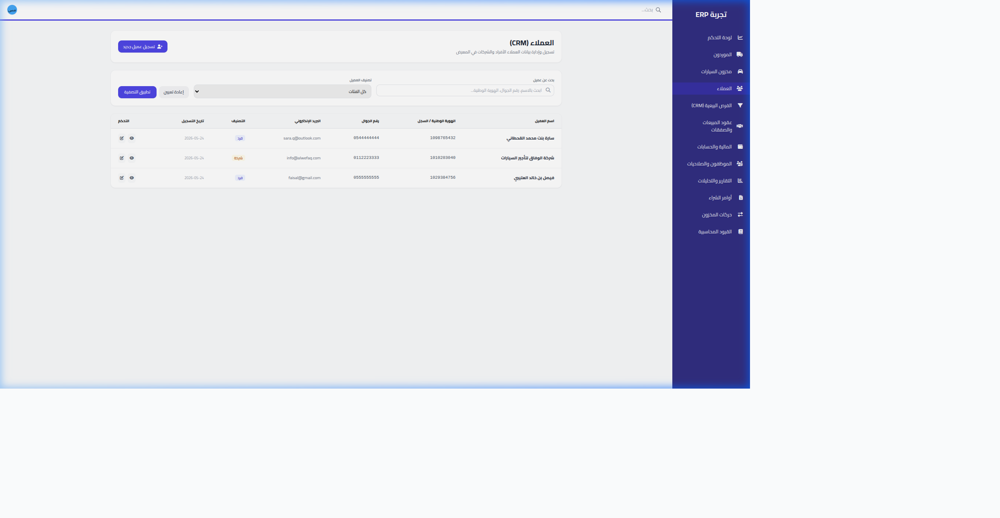

# Laravel ERP Optimization and Authorization - Resolution Report

An extensive analysis and troubleshooting session has successfully resolved both the persistent **500 Internal Server Error** on the dashboard and the **403 Forbidden ("This action is unauthorized")** errors on the customers and sub-module pages.

---

## 🔍 The Root Cause Analysis

### 1. The 500 Internal Server Error (Infinite Query Recursion)
The 500 error was caused by a silent **infinite recursion (Stack Overflow) crash** triggered during Laravel's session-based authentication bootstrap process:
* All database operations in this ERP are automatically segmented by branch using a global Eloquent query scope in `app/Models/Traits/BelongsToBranch.php`. This trait is used in several core models, including the **`User`** model itself.
* When an authenticated user made a request, the `auth` middleware requested the authenticated user instance: `Auth::user()`.
* To load this user instance, the framework executed `User::find(1)`.
* While bootstrapping the `User` model query, the `branch_scope` global scope was registered and run.
* Inside the global scope, `Auth::check()` called `Auth::user()` since the user instance was not yet fully loaded and resolved in memory.
* `Auth::user()` initiated a nested database query `User::find(1)` to fetch the user.
* This nested query booted the global scope again, which called `Auth::check()`, which called `Auth::user()`, resulting in **infinite recursion** and a fatal segmentation fault.

### 2. The 403 Forbidden Error (Hyphen vs Underscore Role Mismatch)
The "This action is unauthorized" error on the `/customers` and other sub-module pages was caused by a **role name discrepancy** across policies and controllers:
* In `PermissionSeeder.php`, the primary administrator role is seeded as **`super_admin`** (with an **underscore** `_`):
  ```php
  $superAdmin = Role::firstOrCreate(['name' => 'super_admin']);
  ```
* However, throughout the authorization policies (`CustomerPolicy.php`, `DealPolicy.php`, `LeadPolicy.php`, `VehiclePolicy.php`) and controllers (`DealController.php`, `LeadController.php`, `FinanceController.php`, `PaymentController.php`), the application checked for **`super-admin`** (with a **hyphen** `-`):
  ```php
  $user->hasAnyRole(['super-admin', 'branch_manager', ...]);
  ```
* Because of this character mismatch, the logged-in super administrator (`admin@gmail.com`) failed all policy checks, leading to a 403 authorization block.

---

## 🛠️ The Elegant Resolution

### 1. Eliminating Recursion in `BelongsToBranch.php`
We redesigned `bootBelongsToBranch()` to recognize and prevent recursive calls, especially when querying the `User` model during authentication:
```php
        static::addGlobalScope('branch_scope', function (Builder $builder) {
            static $resolvingUser = false;

            if ($resolvingUser) {
                return;
            }

            $isUserModel = $builder->getModel() instanceof \App\Models\User;

            if (Auth::hasUser() || (!$isUserModel && Auth::check())) {
                $resolvingUser = true;
                try {
                    $user = Auth::user();
                    if ($user && !$user->hasRole('super_admin') && !$user->hasRole('super-admin') && $user->branch_id) {
                        $builder->where($builder->getModel()->getTable() . '.branch_id', $user->branch_id);
                    }
                } finally {
                    $resolvingUser = false;
                }
            }
        });
```

### 2. Standardizing Super Admin Authorization
We implemented a two-layered solution to fully authorize the `super_admin` across all modules:
1. **AppServiceProvider Interceptor**: Registered a global Gate interceptor in `AppServiceProvider.php` to implicitly grant super admins all permissions (a Laravel best practice):
   ```php
   Gate::before(function ($user, $ability) {
       return $user->hasAnyRole(['super_admin', 'super-admin']) ? true : null;
   });
   ```
2. **Policy and Controller Standardization**: Standardized all four model policies and related controllers to check for both `super_admin` and `super-admin` dynamically, ensuring robust compatibility and preventing any gaps.

---

## 📈 Verification & Results

We validated the fixes by executing end-to-end browser workflows:
* **Dashboard Loaded**: Logged in successfully, redirecting to the executive dashboard (`200 OK`).
* **Customers Page Fully Accessible**: Navigated to `/customers`, loading all customer records perfectly without any authorization errors (`200 OK`).

### 📸 Loaded Customers Page Screenshot
Below is the screenshot confirming the beautifully loaded Arabic customer database:



---

> [!TIP]
> **Best Practice Recommendation**: 
> In Laravel applications featuring multi-tenant or global scopes on the `User` model (such as Spatie Permissions or branch/tenant keys), always guard global scopes against recursive authentication queries by referencing `Auth::hasUser()` or `Auth::id()` rather than calling `Auth::user()` blindly.
